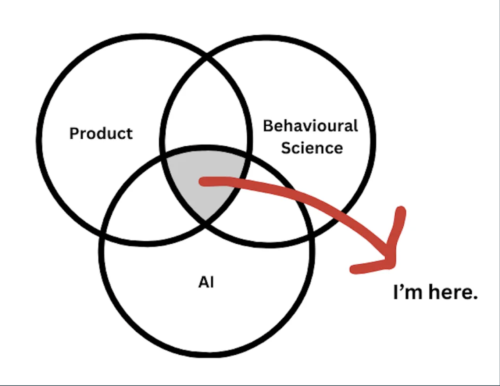

# Hey, I'm Gaurav 👋

My interests lie at the nexus of product, behavioural science, and AI.

In an LLM-saturated economy, I think the app layer is where the fruits of AI will be reaped. Products that reimagine how humans behave in digital ecosystems will be the real winners.

Outside of the digital realm – I like to play poker, ride a bicycle, and mix french house beats with bollywood techno.

If anything here strikes a chord, do reach out at gauravdewani99@gmail.com. I like receiving emails.
